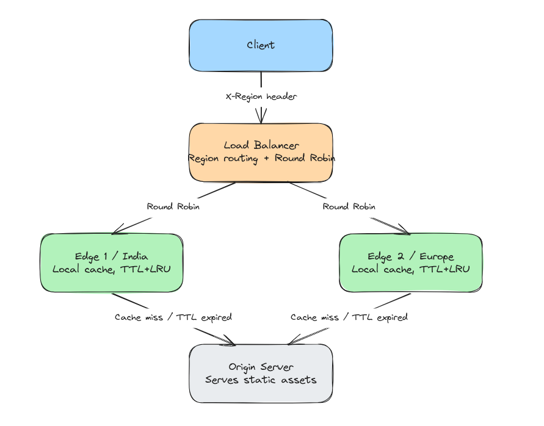
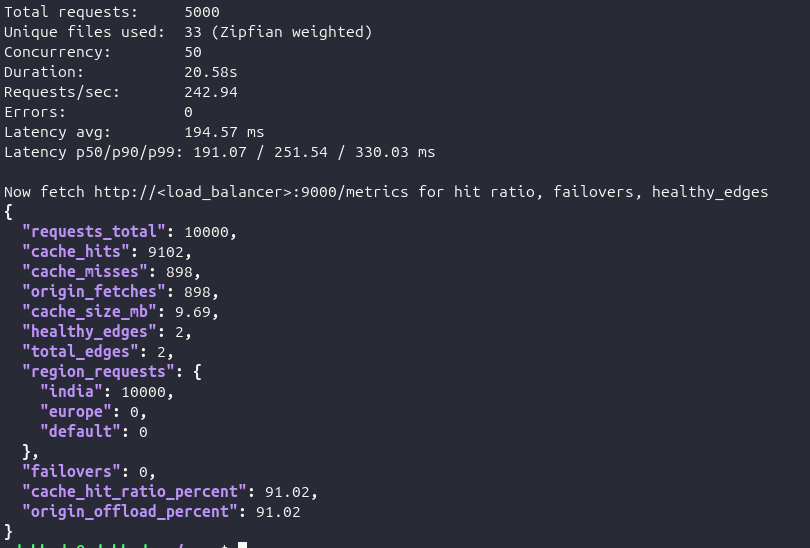
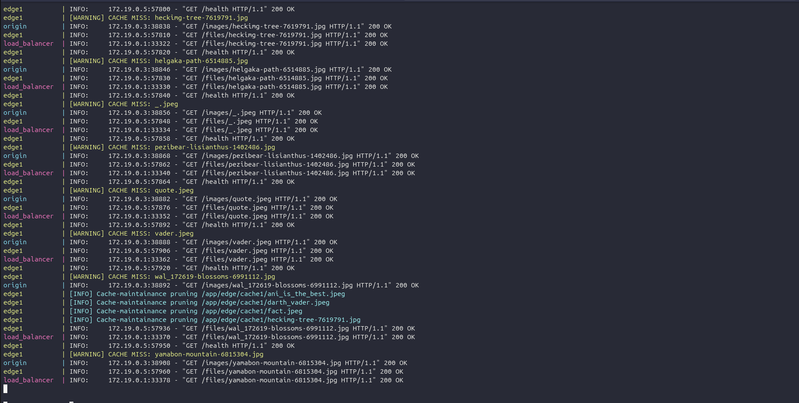

# Distributed CDN using FastAPI

A lightweight Content Delivery Network (CDN) built with **FastAPI** demonstrating geo-aware routing, edge caching, health-aware load balancing, and centralized metrics. The project is fully containerized using Docker Compose.

---

## Features

- Origin server serving static assets
- Two independent edge servers with local caches
- Region-aware routing using the `X-Region` header
- Round Robin load balancing
- Health checks with automatic failover
- TTL-based cache validation
- LRU cache eviction
- Centralized metrics aggregation
- Docker Compose deployment

---

## Architecture

```text
                  +-------------+
                  |   Client    |
                  +------+------+
                         |
                  X-Region Header
                         |
                         v
                +------------------+
                |  Load Balancer   |
                | Geo Routing + RR |
                +----+--------+----+
                     |        |
                India|        |Europe
                     |        |
               +-----v--+ +---v-----+
               | Edge 1 | | Edge 2  |
               | Cache  | | Cache   |
               +----+---+ +----+----+
                    \         /
                     \       /
                      +-----+
                      |Origin|
                      +------+
```

---

## Request Flow

1. Client requests a file through the Load Balancer.
2. Region is selected from the `X-Region` header.
3. A healthy edge is selected using Round Robin.
4. The edge checks its local cache.
5. Cache hit → file served immediately.
6. Cache miss or expired TTL → fetch from Origin, cache locally, then serve.
7. Metrics are updated on every request.

---

## Cache Management

- **TTL Validation** ensures stale content is refreshed.
- **LRU Eviction** removes least recently used files when cache capacity is exceeded.
- Each edge maintains an independent cache.

---

## Metrics

The system exposes:

- Requests Total
- Cache Hits / Misses
- Cache Hit Ratio
- Origin Fetches
- Origin Offload Percentage
- Cache Size
- Cache File Count
- Average Cache Hit/Miss Latency
- Healthy Edge Count
- Region-wise Requests
- Failover Count
- TTL Expirations
- Cache Evictions

---

## Benchmark Results

Measured with a custom weighted-random load generator (`benchmark.py`) simulating
realistic CDN traffic — a Zipfian distribution across the file corpus (a small
"hot" subset receives most requests, the rest form a long tail), rather than a
uniform loop over every file.

| Metric | Result |
|---|---:|
| Total requests | 5,000 |
| Unique files (corpus) | 33 (Zipfian-weighted) |
| Concurrency | 50 |
| Duration | 19.94s |
| Requests/sec | 250.77 |
| Errors | 0 |
| Cache Hit Ratio | 88.68% |
| Origin Offload | 88.68% |
| Latency p50 / p90 / p99 | 183ms / 235ms / 330ms |

Run started from a cold (empty) cache, so hit ratio reflects convergence onto the
hot set as the run progressed — a steady-state run would show a stable-higher
number. Reproduce with:
```bash
python3 benchmark.py --url http://localhost:9000 --requests 5000 --concurrency 50
```

---

## API Endpoints

### Origin
- `GET /images/{filename}`

### Edge
- `GET /files/{filename}`
- `GET /health`
- `GET /metrics`

### Load Balancer
- `GET /files/{filename}`
- `GET /health`
- `GET /metrics`

---

## Run

```bash
docker compose up --build
```

- Origin: http://localhost:8000
- Edge 1: http://localhost:8001
- Edge 2: http://localhost:8002
- Load Balancer: http://localhost:9000

---

## Screenshots

### System Architecture



### Load Test Results



### Cache Behaviour



---

## Future Improvements

- Multiple edge nodes per region
- Persistent metrics using Prometheus/Grafana
- HTTPS support
- Kubernetes deployment
- Distributed cache synchronization

---

## Tech Stack

- Python 3.13
- FastAPI
- HTTPX
- Docker
- Docker Compose
- Uvicorn
